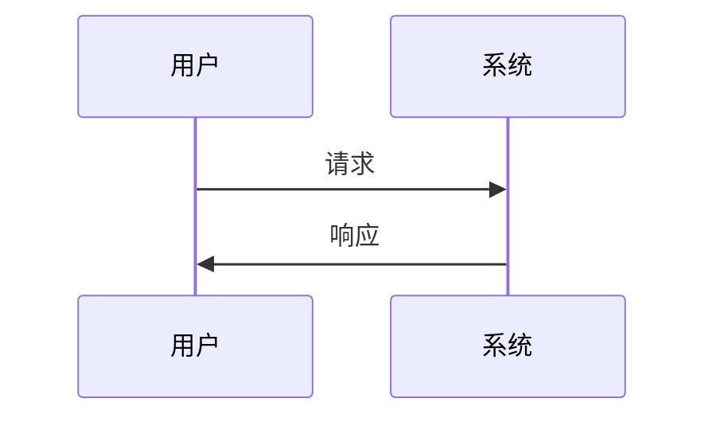
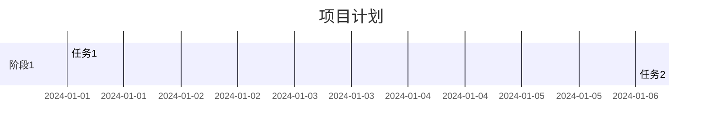

# Mermaid 全局配置指南

## 🎯 一次性解决方案

### 1. 安装全局 VSCode 扩展

在 VSCode 中安装以下扩展（一次安装，所有项目生效）：

```bash
# 通过命令行安装（推荐）
code --install-extension bierner.markdown-mermaid
code --install-extension ms-vscode.vscode-markdown
code --install-extension yzhang.markdown-all-in-one
```

或者通过 VSCode 扩展面板搜索安装：
- `bierner.markdown-mermaid`
- `ms-vscode.vscode-markdown` 
- `yzhang.markdown-all-in-one`

### 2. 配置全局 VSCode 设置

打开 VSCode 设置（`Cmd+,`），搜索 "mermaid"，配置：

```json
{
  "markdown.preview.breaks": true,
  "markdown.preview.fontSize": 14,
  "markdown.preview.lineHeight": 1.6,
  "markdown.preview.scrollPreviewWithEditor": true,
  "markdown.preview.scrollEditorWithPreview": true,
  "markdown.preview.mermaidTheme": "default",
  "markdown.preview.mermaidRenderMode": "svg"
}
```

### 3. 验证配置

1. 打开任意 `.md` 文件
2. 添加 Mermaid 代码块：
   ```markdown
   ```mermaid
   graph TD
       A[开始] --> B[结束]
   ```
   ```
3. 按 `Cmd+Shift+V` 打开预览
4. 应该能看到渲染的图表

## 🔧 项目级配置（可选）

如果需要在特定项目中自定义配置，可以创建 `.vscode/settings.json`：

```json
{
  "markdown.preview.mermaidTheme": "dark",
  "markdown.preview.fontSize": 16
}
```

## 🚀 快速测试

创建一个测试文件 `test-mermaid.md`：

```markdown
# Mermaid 测试

## 流程图


## 时序图


## 甘特图

```

## 📋 常见问题

### Q: 图表不显示？
A: 确保安装了 `bierner.markdown-mermaid` 扩展

### Q: 预览窗口空白？
A: 检查语法是否正确，确保使用 ````mermaid` 代码块

### Q: 主题不生效？
A: 在设置中配置 `markdown.preview.mermaidTheme`

## 🎨 主题选项

```json
{
  "markdown.preview.mermaidTheme": "default"  // 可选: default, dark, forest
}
```

## 📚 支持的图表类型

- ✅ 流程图 (graph/flowchart)
- ✅ 时序图 (sequenceDiagram)
- ✅ 甘特图 (gantt)
- ✅ 类图 (classDiagram)
- ✅ 状态图 (stateDiagram)
- ✅ 饼图 (pie)
- ✅ 用户旅程图 (journey)

---

**注意**: 这些配置是全局的，安装一次后所有项目都会生效，无需重复配置。 