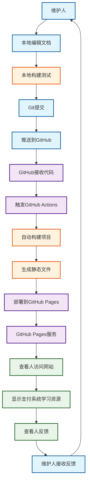
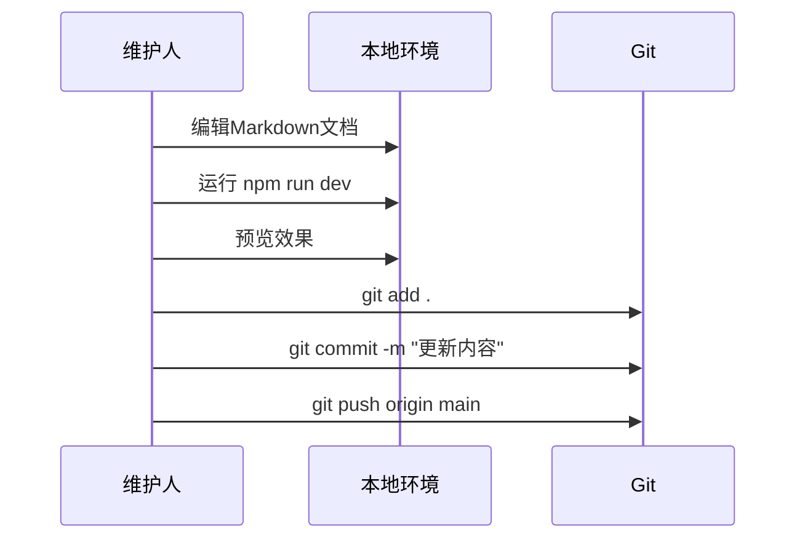
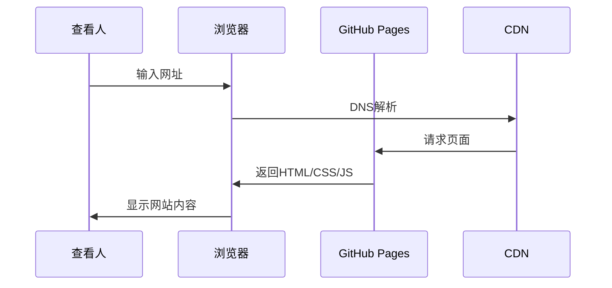
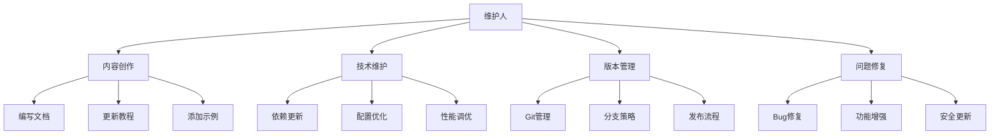
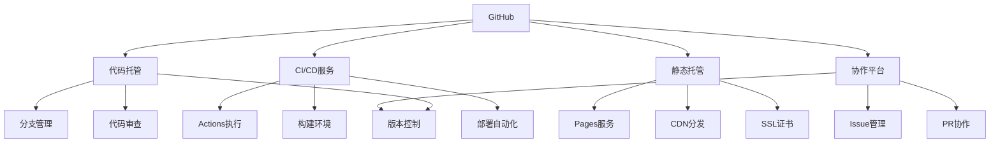
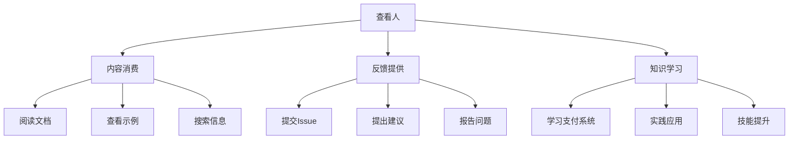
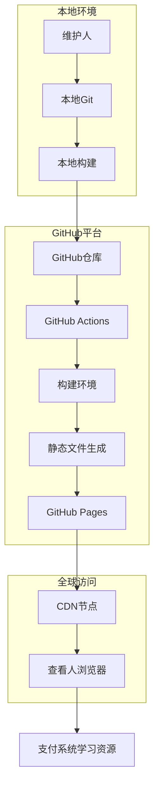
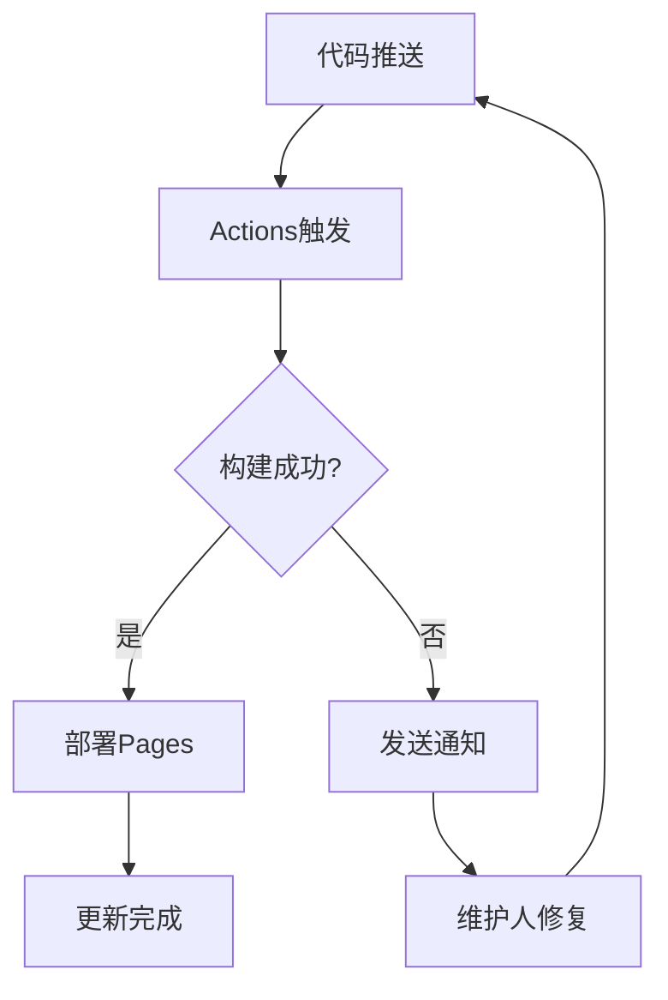
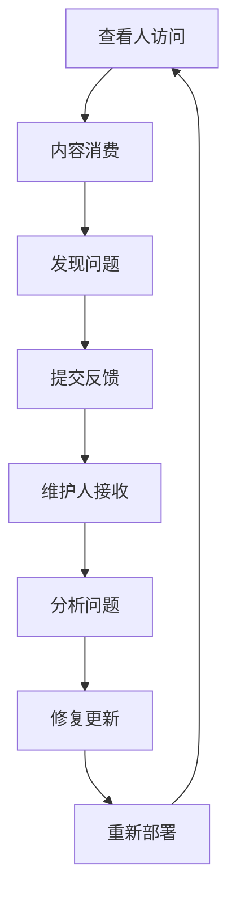

# GitHub Pages 部署流程图

## 完整部署流程



## 详细流程说明

### 1. 维护人操作阶段

#### 本地开发


#### 自动化脚本
```bash
# 快速部署脚本
./scripts/deploy.sh

# 或手动操作
npm install --legacy-peer-deps
npm run build
git add .
git commit -m "部署更新"
git push origin main
```

### 2. GitHub Actions 自动化流程

#### 构建和部署


#### 详细步骤
```yaml
# .github/workflows/static-pages.yml
name: Deploy Static Pages
on:
  push:
    branches: [ main ]

jobs:
  build-and-deploy:
    runs-on: ubuntu-latest
    steps:
    - name: Checkout
      uses: actions/checkout@v4
      
    - name: Setup Node.js
      uses: actions/setup-node@v4
      with:
        node-version: '18'
        cache: 'npm'
        
    - name: Install dependencies
      run: npm ci --legacy-peer-deps
      
    - name: Build
      run: npm run build
      
    - name: Setup git user
      run: |
        git config --global user.name "github-actions[bot]"
        git config --global user.email "github-actions[bot]@users.noreply.github.com"

    - name: Deploy to GitHub Pages
      uses: peaceiris/actions-gh-pages@v3
      with:
        github_token: ${{ secrets.GITHUB_TOKEN }}
        publish_dir: ./docs/.vuepress/dist
        force_orphan: true
```

### 3. 查看人访问流程

#### 网站访问


#### 访问地址
```
🌐 网站地址: https://findstarer.github.io/trading-system/
📚 文档内容: 支付系统学习资源
🔍 功能特性: 搜索、导航、响应式设计
```

## 时间线分析

### 各阶段耗时

```mermaid
gantt
    title 部署时间线
    dateFormat  X
    axisFormat %s
    
    section 维护人操作
    本地编辑    :done, edit, 0, 300
    本地测试    :done, test, 300, 600
    代码推送    :done, push, 600, 900
    
    section GitHub处理
    触发Actions  :done, trigger, 900, 1200
    构建项目    :done, build, 1200, 1800
    部署Pages   :done, deploy, 1800, 2400
    
    section 查看人访问
    网站可访问  :done, available, 2400, 3000
```


### 关键时间点
- **0-5分钟**: 维护人完成代码推送
- **5-10分钟**: GitHub Actions自动构建和部署
- **10分钟后**: 查看人可访问更新后的网站

## 参与方职责

### 维护人 (Maintainer)


### GitHub 平台


### 查看人 (Viewer)


## 技术架构

### 部署架构


### 文件流转


## 监控和反馈

### 部署状态监控


### 反馈循环


---

*这个流程图展示了从维护人编辑到查看人访问的完整GitHub Pages部署流程，涵盖了所有参与方的职责和交互过程。* 