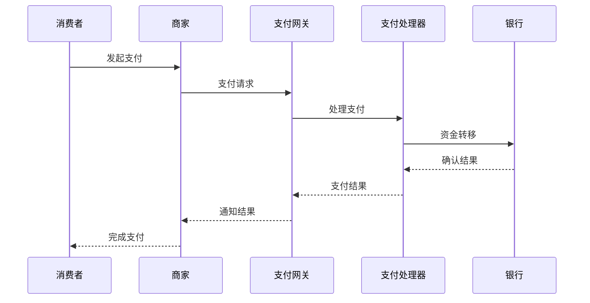

# 支付系统概述

## 什么是支付系统？

支付系统是一个处理货币转移的复杂技术平台，它连接了消费者、商家、银行和支付服务提供商，实现安全、快速、可靠的资金转移。

## 核心组件

### 1. 支付网关 (Payment Gateway)
- **功能**：处理支付请求，连接不同的支付方式
- **职责**：路由、验证、安全处理
- **示例**：Stripe、PayPal、支付宝、微信支付

### 2. 支付处理器 (Payment Processor)
- **功能**：处理具体的支付交易
- **职责**：交易验证、清算、结算
- **示例**：银行、信用卡网络

### 3. 风控系统 (Risk Management)
- **功能**：识别和预防欺诈行为
- **职责**：风险评估、规则引擎、机器学习
- **技术**：实时监控、异常检测

### 4. 对账系统 (Reconciliation)
- **功能**：确保交易数据的一致性
- **职责**：账目核对、差异处理、报表生成
- **重要性**：财务准确性的关键

## 支付流程



## 支付方式

### 传统支付方式
- **银行卡**：信用卡、借记卡
- **银行转账**：ACH、SEPA、SWIFT
- **现金**：线下支付

### 数字支付方式
- **移动支付**：Apple Pay、Google Pay
- **电子钱包**：PayPal、支付宝、微信支付
- **加密货币**：比特币、以太坊

## 技术架构

### 微服务架构
```
┌─────────────────┐    ┌─────────────────┐    ┌─────────────────┐
│   用户服务      │    │   订单服务      │    │   支付服务      │
└─────────────────┘    └─────────────────┘    └─────────────────┘
         │                       │                       │
         └───────────────────────┼───────────────────────┘
                                 │
                    ┌─────────────────┐
                    │   消息队列      │
                    └─────────────────┘
```

### 数据存储
- **关系型数据库**：MySQL、PostgreSQL（交易数据）
- **NoSQL数据库**：MongoDB、Redis（缓存、会话）
- **消息队列**：Kafka、RabbitMQ（异步处理）

## 安全考虑

### 数据安全
- **加密**：传输加密（TLS）、存储加密（AES）
- **令牌化**：敏感数据替换为令牌
- **PCI DSS**：支付卡行业数据安全标准

### 访问控制
- **身份验证**：多因素认证（MFA）
- **授权**：基于角色的访问控制（RBAC）
- **审计**：完整的操作日志

## 性能要求

### 高可用性
- **99.9%+ 可用性**
- **故障转移**：多区域部署
- **负载均衡**：自动扩展

### 低延迟
- **响应时间**：< 2秒
- **并发处理**：支持高并发
- **缓存策略**：多层缓存

## 合规要求

### 法规遵循
- **GDPR**：欧盟数据保护
- **SOX**：萨班斯-奥克斯利法案
- **本地法规**：各国支付法规

### 审计要求
- **交易记录**：完整保留
- **审计跟踪**：可追溯性
- **报告**：定期合规报告

## 监控和运维

### 监控指标
- **业务指标**：交易量、成功率、收入
- **技术指标**：响应时间、错误率、可用性
- **安全指标**：欺诈检测、异常行为

### 告警机制
- **实时告警**：关键指标异常
- **分级告警**：不同严重程度
- **自动恢复**：故障自动修复

## 发展趋势

### 新技术
- **AI/ML**：智能风控、个性化服务
- **区块链**：去中心化支付
- **API经济**：开放银行API

### 用户体验
- **无摩擦支付**：一键支付
- **生物识别**：指纹、面部识别
- **语音支付**：语音助手集成

---

*下一步：了解 [支付流程详解](./payment-flow.md)* 