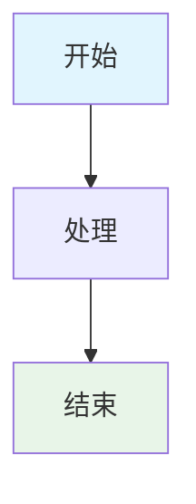
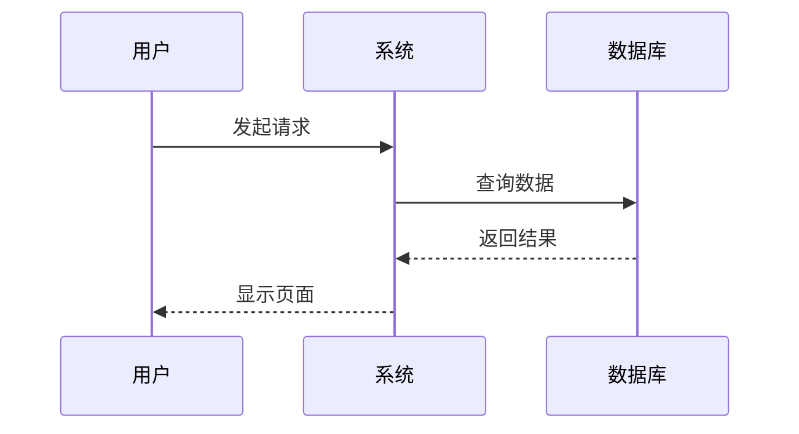
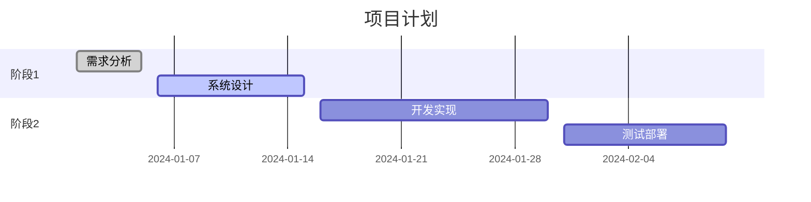
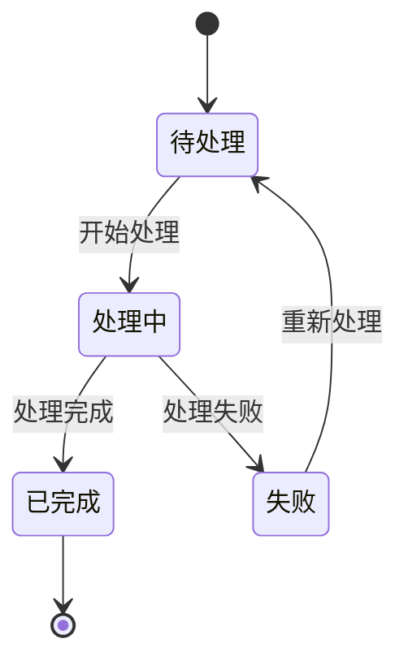
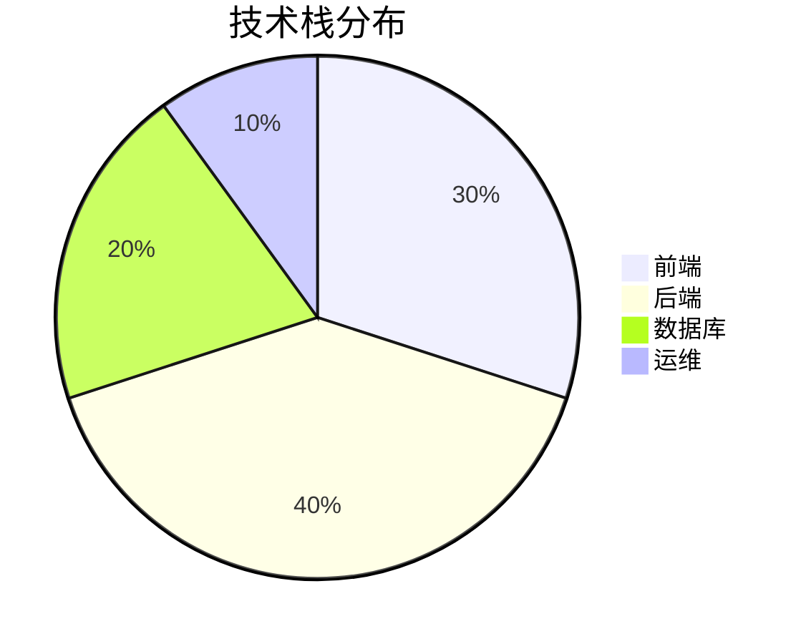

# Mermaid 测试文件

## 流程图测试

```mermaid
graph TD
    A[开始] --> B[处理]
    B --> C[结束]
    style A fill:#e1f5fe
    style C fill:#e8f5e8
```

## 时序图测试

```mermaid
sequenceDiagram
    participant U as 用户
    participant S as 系统
    participant D as 数据库
    
    U->>S: 发起请求
    S->>D: 查询数据
    D-->>S: 返回结果
    S-->>U: 显示页面
```

## 甘特图测试

```mermaid
gantt
    title 项目计划
    dateFormat  YYYY-MM-DD
    section 阶段1
    需求分析    :done, req, 2024-01-01, 2024-01-05
    系统设计    :active, design, 2024-01-06, 2024-01-15
    section 阶段2
    开发实现    :dev, 2024-01-16, 2024-01-30
    测试部署    :test, 2024-01-31, 2024-02-10
```

## 状态图测试

```mermaid
stateDiagram-v2
    [*] --> 待处理
    待处理 --> 处理中 : 开始处理
    处理中 --> 已完成 : 处理完成
    处理中 --> 失败 : 处理失败
    失败 --> 待处理 : 重新处理
    已完成 --> [*]
```

## 饼图测试

```mermaid
pie title 技术栈分布
    "前端" : 30
    "后端" : 40
    "数据库" : 20
    "运维" : 10
```

---

**测试说明**：
1. 打开此文件
2. 按 `Cmd+Shift+V` 打开预览
3. 应该能看到所有图表正常渲染
4. 如果没有显示，请检查扩展是否正确安装 